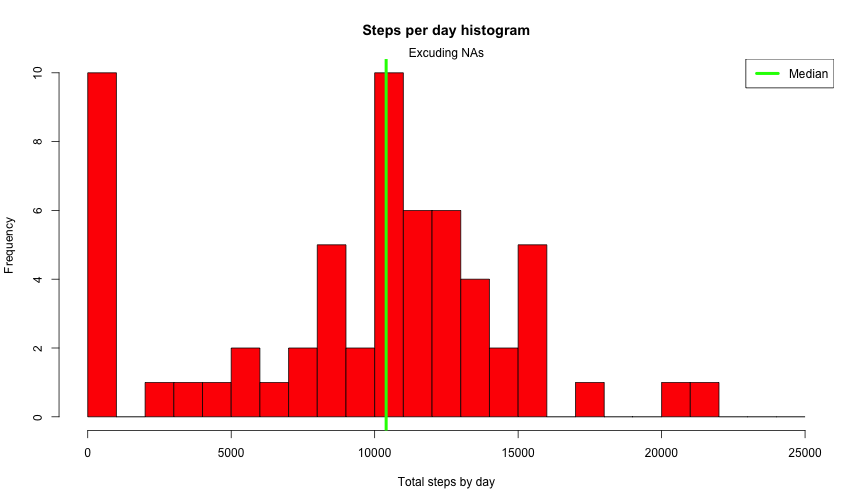
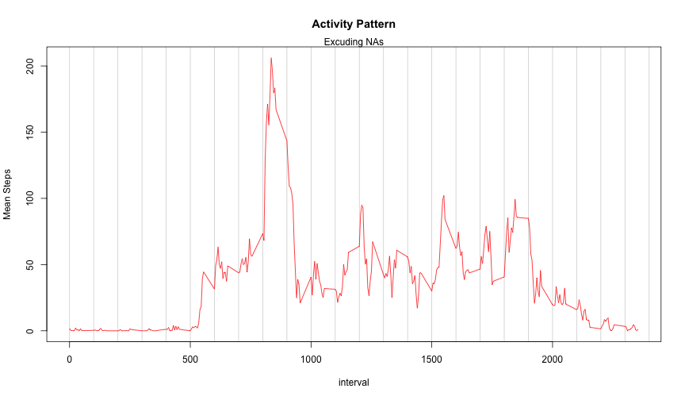
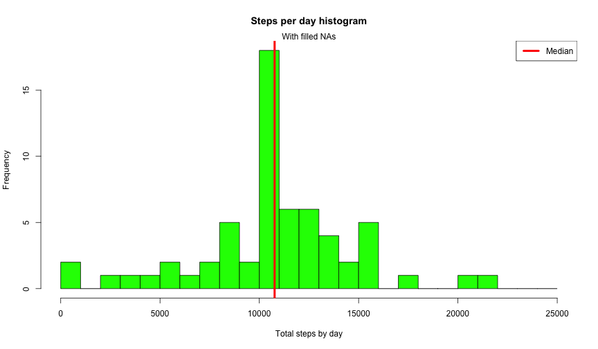

## Introduction

This assignment makes use of data from a personal activity monitoring device. This device collects data at 5 minute intervals through out the day. The data consists of two months of data from an anonymous individual collected during the months of October and November, 2012 and include the number of steps taken in 5 minute intervals each day.

## Data

The data for this assignment can be downloaded from the course web site:

- Dataset: [Activity monitoring data](https://d396qusza40orc.cloudfront.net/repdata%2Fdata%2Factivity.zip) [52K]

The variables included in this dataset are:

- steps: Number of steps taking in a 5-minute interval (missing values are coded as NA)

- date: The date on which the measurement was taken in YYYY-MM-DD format

- interval: Identifier for the 5-minute interval in which measurement was taken

- The dataset is stored in a comma-separated-value (CSV) file and there are a total of 17,568 observations in this dataset.


## Loading and preprocessing the data

Before staring the actual data manipulations a few R library are imported for subsequent use.


```r
library(dplyr, warn.conflicts = FALSE)
library(lubridate, warn.conflicts = FALSE)
library(ggplot2, warn.conflicts = FALSE)
```

Then the data file is downloaded (if needed) and unzipped ending up with the raw data file `activity.csv`.

```r
if (!file.exists("activity.zip")) {
    download.file(
        "https://d396qusza40orc.cloudfront.net/repdata%2Fdata%2Factivity.zip",
        "activity.zip",
        method = "curl"
    )
}
unzip("activity.zip")
```

Now the data are imported in `activity` as a `tbl_df` suitable for use with the `dplyr` library. Classes are predefined (see above data description) and strings (i.e.: the dates) are not converted into factors. For convenience the `date` feature is converted into an actual date type.

```r
activity = read.csv("activity.csv",
                    colClasses = c("numeric", "character", "numeric"),
                    stringsAsFactors = FALSE) %>%
                    tbl_df %>%
                    mutate(date = ymd(date))     # Convert date string into date
```

## What is mean total number of steps taken per day?

The `stepsByDay` is obtained grouping `activity` by `date` and then summarising the groups with the sum of all the steps.

```r
stepsByDay = group_by(activity, date) %>%
                    summarise(totalSteps = sum(steps, na.rm = TRUE))
```

For convenience the summary of `stepsByDay` is calculated:

```r
stepsByDaySummary = summary(stepsByDay$totalSteps)
stepsByDaySummary
```

```
##    Min. 1st Qu.  Median    Mean 3rd Qu.    Max. 
##       0    6778   10400    9354   12810   21190
```

The **mean** steps by day is 
**9354**
and the **median** is
**10400**

Now the histogram of the total number of steps taken each day can be shown.

```r
with(stepsByDay, 
     hist(totalSteps,
          breaks=seq(0, 25000, by = 1000),
          col = "red",
          xlab = "Total steps by day",
          main = "Steps per day histogram"
          )
)
mtext("Excuding NAs", side = 3, line = 0)
```

 

Breakpoints every 1000 steps emphasize the amount of days with almost zero steps. Thus the first bar gives us a hint about the possible impact of NA's.


## What is the average daily activity pattern?

The `meanStepsByInterval` dataset is obtained gouping `activity` by `interval` and summarising with the mean of `steps` for each group. In this case NA's are not considered.

```r
meanStepsByInterval = group_by(activity, interval) %>%
                        summarize(meanSteps = mean(steps, na.rm = TRUE))
```

The activity pattern (mean steps by interval) can be plotted:

```r
with(meanStepsByInterval, {
    plot(interval, meanSteps,
         type = "l",
         col = "red",
         ylab = "Mean Steps",
         main = "Activity Pattern")
})
mtext("Excuding NAs", side = 3, line = 0)
```

 

The 5-minute interval, on average across all the days in the dataset, that contains the maximum number of steps can be calculated: `meanStepsByInterval` is filtered by the rows in which `meanSteps` corresponds to the `max(meanSteps)`.


```r
filter(meanStepsByInterval, meanSteps == max(meanSteps))
```

```
## Source: local data frame [1 x 2]
## 
##   interval meanSteps
##      (dbl)     (dbl)
## 1      835  206.1698
```

## Imputing missing values

The rows having NA's as number of steps goes into `stepsNA` then the total number of missing steps count is calculculated as `totalMissing`.

```r
stepsNA = is.na(activity$steps)
totalMissing = sum(stepsNA)
totalMissing
```

```
## [1] 2304
```
There are **2304** missing steps counts.

The strategy for filling in all of the missing values in the dataset is to replace NA's with the overall mean for that 5-minute interval.

In order to do this a copy of `activity` is made and named `filledActivity` since it will contain the filled dataset.


```r
filledActivity = activity
```

Having already calculated `meanStepsByInterval` and the measures having NA as steps (i.e.: `stepsNA`), we can join this information by `interval`.


```r
stepsToFill = data.frame(interval = activity[stepsNA,"interval"]) %>%
                                inner_join(meanStepsByInterval, by = "interval")
summary(stepsToFill$meanSteps)
```

```
##    Min. 1st Qu.  Median    Mean 3rd Qu.    Max. 
##   0.000   2.486  34.110  37.380  52.830 206.200
```
`stepsToFill` now contains the sequence of interval and the corresponding mean for each `stepsNA`. The steps corresponding to `stepsNA` can now be updated with the joined sequence of `meanSteps` in `stepsToFill`.


```r
filledActivity[stepsNA,]$steps =  stepsToFill$meanSteps
sum(is.na(filledActivity$steps))
```

```
## [1] 0
```

As done above we can calculate the mean, median:

```r
filledStepsByDay = group_by(filledActivity, date) %>%
                    summarise(totalSteps = sum(steps))

filledStepsByDaySummary = summary(filledStepsByDay$totalSteps)
filledStepsByDaySummary
```

```
##    Min. 1st Qu.  Median    Mean 3rd Qu.    Max. 
##      41    9819   10770   10770   12810   21190
```
The **mean** steps by day is 
**10770**
and the **median** is
**10770**

The histogram corresponding to the filled dataset can be shown.

```r
with(filledStepsByDay, 
     hist(totalSteps,
          breaks=seq(0, 25000, by = 1000),
          col = "green",
          xlab = "Total steps by day",
          main = "Steps per day histogram")
)
mtext("With filled NAs", side = 3, line = 0)
```

 

```r
meanStepsByDayGrouth = (filledStepsByDaySummary["Mean"] -
                        stepsByDaySummary["Mean"]) / stepsByDaySummary["Mean"]
medianStepsByDayGrouth = (filledStepsByDaySummary["Median"] -
                            stepsByDaySummary["Median"]) / stepsByDaySummary["Median"]

c("Mean Growth" = meanStepsByDayGrouth,
  "Median Growth" = medianStepsByDayGrouth)
```

```
##     Mean Growth.Mean Median Growth.Median 
##           0.15137909           0.03557692
```

The mean of steps per day grows by 15.14% and the median by 
3.56%

From the histogram we can see that days having almost 0 steps due to NA's moved to the bar including the median.

## Are there differences in activity patterns between weekdays and weekends?
A `dayCategory` factor will be added to the filled dataset in order to distinguis between weekday and weeend. An utility function `toDayFactor` is defined: it takes a date and returns the corresponding category factor (i.e.: _Weekday_ or _Weekend_).

```r
toDayFactor = function(date) {
    dayFactor = factor(c("Weekday", "Weekend"))
    sapply(date, function(d) {
        if (weekdays(d, abbreviate = TRUE) %in% c("Sat", "Sun")) {
            return(dayFactor[2]) # weekend
        }
    
        return(dayFactor[1]) # weekday
    })
}
```
Then `filledActivity` is mutated adding the `dayCategory` factor.

```r
filledActivity =  mutate(filledActivity, 
                    dayCategory = toDayFactor(date))
```
`wMeanStepsByInterval` is the similar to `meanStepsByInterval` from the activity pattern section. Differenses are:

- it is calculated on the filled dataset
- it is also grouped by `dayCategory` and then by `interval`


```r
wMeanStepsByInterval = filledActivity %>% 
                    group_by(dayCategory, interval) %>%
                        summarize(meanSteps = mean(steps))
```
Now two distinct activity pattern can be shown. One for the weekdays and one for the weekend.

```r
qplot(interval, meanSteps,
      data = wMeanStepsByInterval,
      facets = dayCategory ~ .,
      geom = c("line"),
      xlab = "Interval",
      ylab = "Mean Steps"
      )
```

 
Some differences can be seen between weekdays and weekend activity pattern:

- during the weekend the steps peak is around the same interval but lower
- the weekend morning shows a steep reduction of steps in the morning between the peaks of steps. It might be that the subject is used to go to some celebration or out for breakfast.
- The weekend activity pattern seems to show a more distributed activity during the day. 
